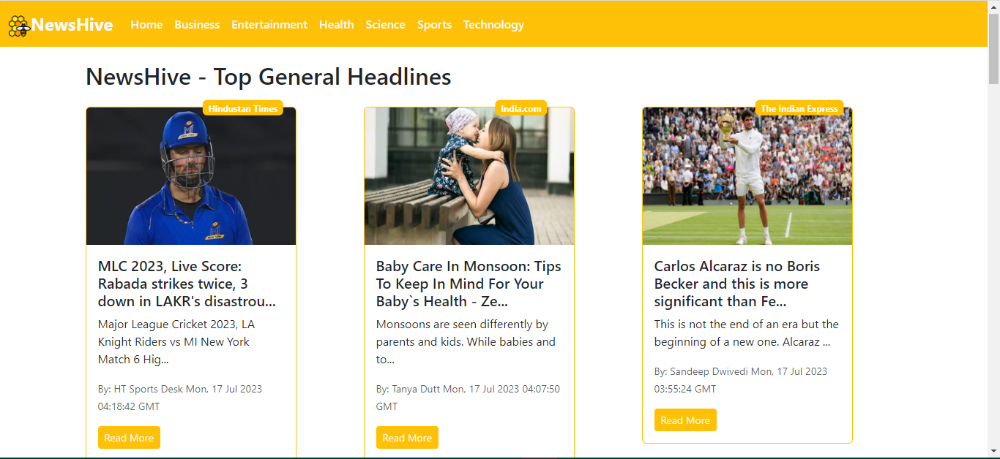

# NewsHive

NewsHive : powered by ReactJS and Bootstrap, utilizes JavaScript to fetch data from an API, delivering an immersive and up-to-date news browsing experience. You can even browse through different categories of news like Business, Entertainment,Health, Science, Sports, Technology etc..

## Built With:

- ReactJS
- Bootstrap
- HTML,CSS

## Screenshots
<h3>Home:</h3>

  

In the project directory, you can run:
### `npm start`

Runs the app in the development mode.\
Open [http://localhost:3000](http://localhost:3000) to view it in your browser.

The page will reload when you make changes.\
You may also see any lint errors in the console.

